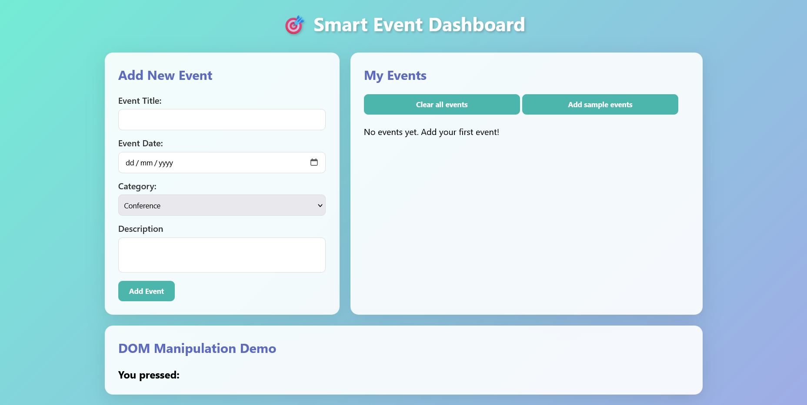

# 🎯 Smart Event Dashboard

A dynamic event management dashboard built using **Vanilla JavaScript** and DOM manipulation.

---

## 🚀 Features

- Add new events
- Delete individual events
- Clear all events
- Add sample events
- Dynamic DOM manipulation
- Keyboard key detection demo

---

## 🛠 Technologies Used

- HTML5
- CSS3 (Grid + Modern UI)
- JavaScript (DOM Manipulation & Event Handling)

---

## 📸 Dashboard Preview

---

## 📚 Concepts Used

- document.querySelector()
- createElement()
- innerHTML
- addEventListener()
- Event Delegation
- preventDefault()
- DOM traversal
